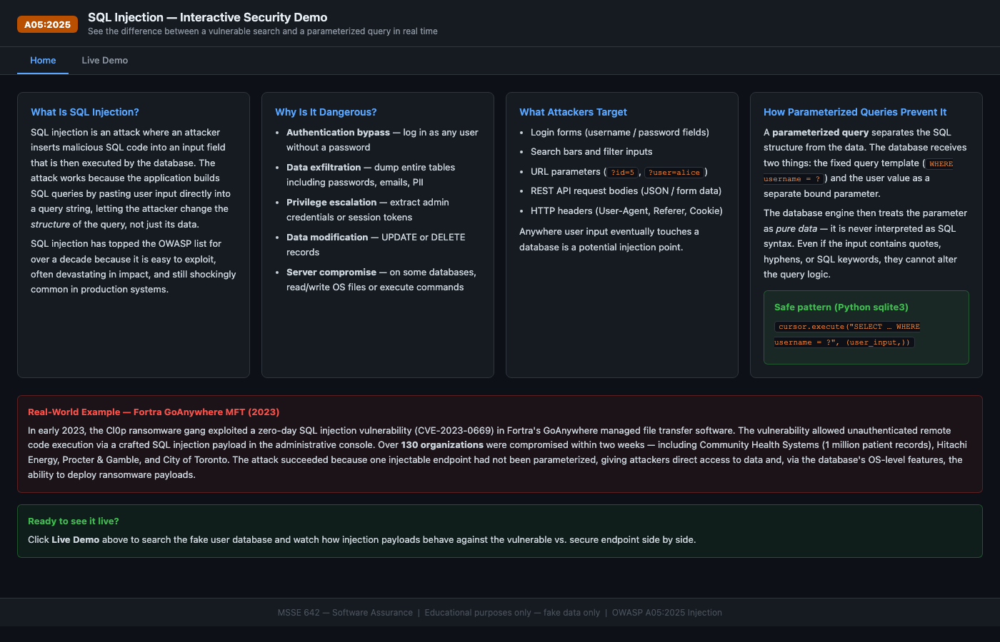
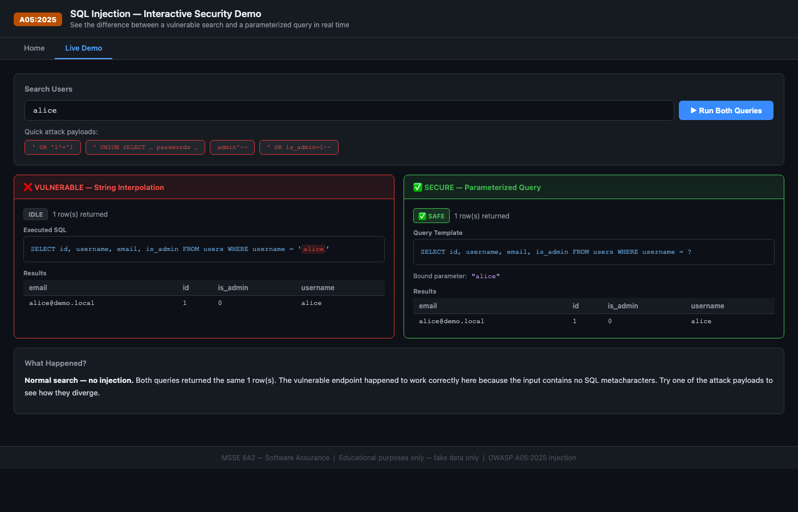
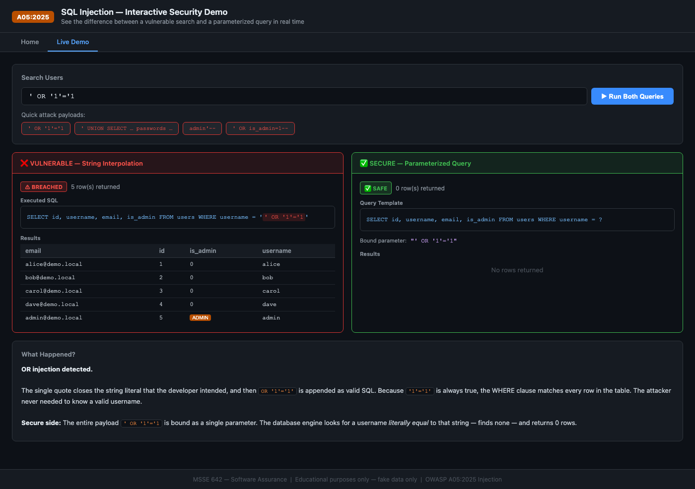
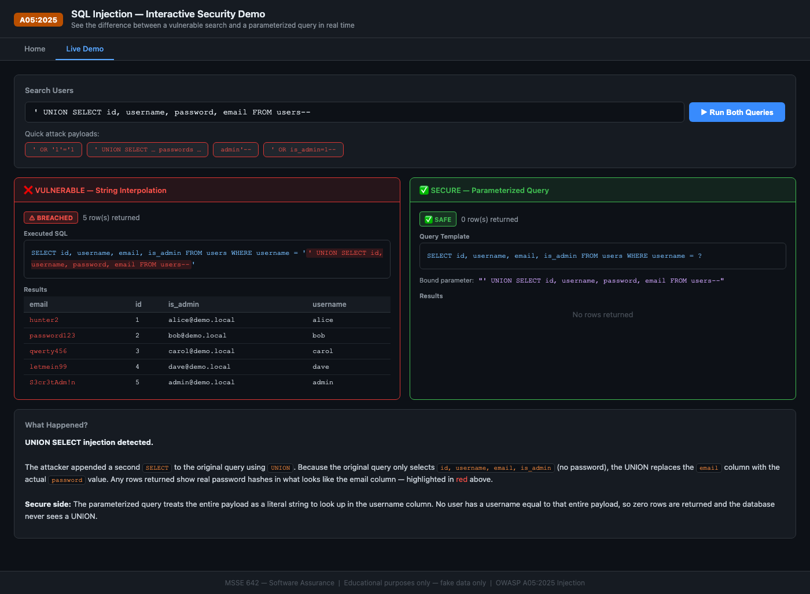
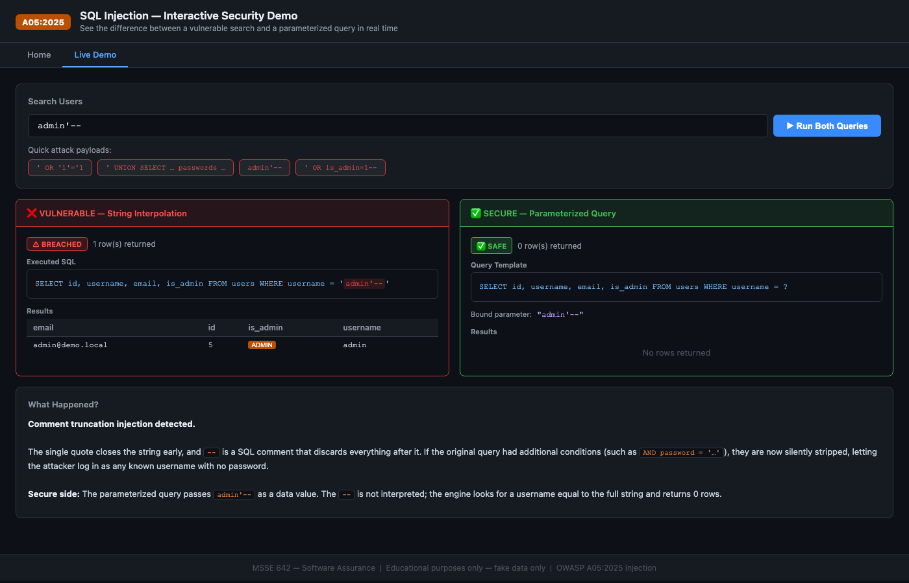

# Vibe Coding Assignment 2: OWASP A05 Injection

**Course:** MSSE 642 – Software Assurance  
**Authors:** Abdullah Bahir, Emad Fattah, Shawn Wilkinson  
**Date:** June 2026  
**OWASP Category:** A05:2025 — Injection

---

## Overview

This assignment used [Replit](https://replit.com) to build and host an interactive educational web app that demonstrates SQL injection — the most well-known form of OWASP A05 Injection. The app lets you type attack payloads into a search box and watch in real time how a vulnerable Python/Flask endpoint handles them versus a secure parameterized endpoint. Both run against the same SQLite database and display their actual SQL queries side by side so you can see exactly what the injection does at the database level.

---

## Tool Chosen

**Tool:** [Replit](https://replit.com)

I chose Replit for this assignment because it makes the full-stack development cycle as frictionless as possible. With Replit I could spin up a Python/Flask environment in seconds, write the code in the browser, and share a live URL without any deployment steps. There is no local Python setup required, no port forwarding, and no hosting configuration — you click Run and get a public link. For an assignment where the goal is to produce something runnable and shareable, Replit removes every obstacle between writing the code and showing it off.

Replit also makes it easy to iterate quickly. I could change the Flask route, reload, and immediately test the new behavior in a browser tab right next to the editor. That tight feedback loop is exactly what "vibe coding" is about — describing what you want, seeing it, adjusting.

---

## Program Description

The deliverable is a Flask + SQLite web application called the **SQL Injection Demo**. It has two pages:

**Home** — explains what SQL injection is, why it is dangerous, what attackers typically target, and how parameterized queries stop it. There is also a real-world example section covering the 2023 Fortra GoAnywhere breach.

**Live Demo** — an interactive search page with:

- A search input where you can type any username or injection payload
- Four quick-attack buttons that pre-load common payloads and run them automatically
- Two side-by-side panels:
  - **Vulnerable** (red border): executes the query via Python f-string interpolation — the exact pattern that causes SQL injection
  - **Secure** (green border): executes the same query with a `?` placeholder and a bound parameter — the correct approach
- A SQL display box in each panel showing the exact SQL that was sent to the database, with the injected portion highlighted in red on the vulnerable side
- A results table showing what each query returned
- An explanation panel at the bottom that describes what happened and why the results differ

The app uses a local SQLite file (`demo.db`) containing five fake users: `alice`, `bob`, `carol`, `dave`, and `admin`. No real user data, no real passwords, and no connection to any external system.

**Why I chose SQL injection:** SQL injection is one of the most visually satisfying vulnerabilities to demonstrate because the attack is visible in plain text. When you watch the SQL query change from `WHERE username = 'alice'` to `WHERE username = '' OR '1'='1'` you can see exactly how the attacker's input rewrote the query logic. It makes the concept click in a way that a paragraph of text cannot. It also directly illustrates why parameterized queries matter — the secure side shows the query template never changing, no matter what you type.

---

## Vulnerability Explored: A05:2025 Injection

OWASP A05:2025 — Injection covers any attack where untrusted data is sent to an interpreter as part of a command or query. SQL injection is the most common form, but the category also covers OS command injection, LDAP injection, XPath injection, and template injection.

### How SQL injection works

A vulnerable application builds a SQL query by concatenating user input directly into a string:

```python
# VULNERABLE
sql = f"SELECT * FROM users WHERE username = '{user_input}'"
```

If `user_input` is `' OR '1'='1`, the resulting query becomes:

```sql
SELECT * FROM users WHERE username = '' OR '1'='1'
```

The single quote closes the string that the developer intended, and the injected `OR '1'='1` clause is valid SQL that evaluates to true for every row. The WHERE clause now matches the entire table instead of one user.

More dangerous is the UNION SELECT attack:

```sql
' UNION SELECT id, username, password, email FROM users--
```

This appends a second SELECT that retrieves a column the original query never intended to expose — the password column. The `--` comments out the rest of the original query so there is no syntax error.

### Why parameterized queries prevent it

A parameterized query sends the SQL structure and the user data as two separate messages to the database engine:

```python
# SECURE
cursor.execute("SELECT * FROM users WHERE username = ?", (user_input,))
```

The database receives the template `WHERE username = ?` first and compiles it. Then it substitutes the user value as pure data. Even if the value is `' OR '1'='1`, the engine treats the entire string as a single username to look up — not as SQL syntax. The query logic cannot change.

---

## Recent Real-World Example

### Fortra GoAnywhere MFT — February/March 2023

**CVE-2023-0669** was a critical SQL injection vulnerability in Fortra's GoAnywhere Managed File Transfer product. The Cl0p ransomware gang discovered and exploited it as a zero-day before a patch was available. The vulnerable endpoint in the administrative console accepted a crafted request containing a SQL injection payload that allowed unauthenticated remote code execution — the injected SQL triggered a stored procedure that could run OS commands on the server.

Within two weeks of active exploitation, over **130 organizations** were compromised, including:

- **Community Health Systems** — 1 million patient records exposed
- **Hitachi Energy** — employee data stolen
- **Procter & Gamble** — supplier information exfiltrated
- **City of Toronto** — internal documents stolen
- **Rubrik** — security company breached (notably ironic)

The attack succeeded because a single API endpoint used string interpolation to build a SQL query from request parameters. One unparameterized input was enough to take down over a hundred organizations. Cl0p later used the access to deploy ransomware and extort victims for months.

This incident is a textbook demonstration of why parameterized queries are non-negotiable: the blast radius of one missed `?` placeholder was 130 organizations and millions of exposed records.

---

## Problems I Ran Into

### Problem 1: Making the UNION attack visually obvious

The most dramatic attack — `' UNION SELECT id, username, password, email FROM users--` — works by overwriting one column of the result with a different column's data. In my case, the original query selects `id, username, email, is_admin` (no password), and the UNION injects the `password` column into the position that `email` normally occupies.

The issue was that this is subtle. The result table looks almost normal — you still see four columns with the same headers — but one column silently contains something different than its label says. A student might not notice.

**How I solved it:** I added a heuristic in the JavaScript that detects when the "email" column contains a value that looks like a password (no `@` sign, only alphanumeric and symbol characters). When that condition is true, the cell renders in red with the `leaked-cell` CSS class. Combined with the explanation panel that explicitly calls out what happened, the visual is now hard to miss.

### Problem 2: Python version conflict

My Mac has Python 3.9 as the system default, but Flask was installed into a Python 3.11 environment managed by Homebrew. Running `python3 app.py` failed with `ModuleNotFoundError: No module found for flask`. Replit would not have this issue because it manages its own isolated Python environment, but it broke local testing.

**How I solved it:** I specified `python3.11` explicitly when running locally. For the Replit deployment the standard `requirements.txt` with `flask>=3.0.0` is enough — Replit installs dependencies automatically.

### Problem 3: Port 5000 conflict on macOS

macOS Monterey and later use port 5000 for AirPlay Receiver, which conflicts with Flask's default development port. Attempting to start the app returned `Address already in use`.

**How I solved it:** Changed the Flask port to 8080 in the Replit configuration and tested locally on an alternate port. On Replit itself, the platform handles port mapping automatically.

### Problem 4: Keeping the explanation panel accurate for all four payloads

Each of the four attack buttons triggers a fundamentally different injection technique (OR clause, UNION SELECT, comment truncation, admin filter), and each needs a different explanation. Writing one generic explanation would miss the point of each attack.

**How I solved it:** I wrote a `buildExplanation()` function in JavaScript that pattern-matches the input string and switches between four distinct explanation templates — each one naming the specific technique, walking through how the injected SQL changed the query, and contrasting it with what the secure endpoint did.

---

## How to Run the App

### On Replit

1. Upload the project folder to a new Replit project (Python template).
2. The `requirements.txt` will install Flask automatically.
3. Click **Run** — Replit starts `main.py`, initializes the database, and opens a preview URL.

### Locally

```bash
pip install flask
python3 main.py
```

Then open `http://localhost:8080` in a browser. The SQLite database is created automatically on first run.

---

## Screenshots

### Home Page — SQL Injection Explained



### Normal Search — Baseline Behavior



Both panels return the same single row when the input is a plain username with no injection characters. This is the expected baseline.

### OR Injection — Full Table Dump



The payload `' OR '1'='1` closes the string early and appends a condition that is always true. The vulnerable side returns all 5 users; the secure side returns 0 rows because the entire payload is treated as a literal string.

### UNION SELECT — Password Column Leaked



The UNION attack appends a second SELECT that pulls the `password` column into the position normally occupied by `email`. Leaked values are highlighted in red. The secure side again returns 0 rows.

### Admin Bypass — Comment Truncation



`admin'--` closes the username string and uses `--` to comment out the rest of the query. The vulnerable endpoint returns the admin user record directly. The secure endpoint finds no user with that literal string as a username.

---

## Reflection

This project reinforced something I think is easy to forget when learning about injection vulnerabilities: the attack is not exotic. There is no brute force, no cryptography, no zero-day exploit. The attacker types a single quote into a text box. The entire attack fits in one line of input. And yet it can expose every row in a database, bypass authentication entirely, or — as with Fortra GoAnywhere — lead to ransomware deployment across a hundred organizations.

Building both sides of the demo simultaneously made the fix feel real in a way that just reading about parameterized queries does not. The vulnerable endpoint is six lines of Python. The secure endpoint is also six lines. The only difference is `f"...'{q}'"` versus `"...?"` with `(q,)` as a bound argument. That is a two-character change. The security difference between those two patterns is the entire gap between "all your user data is exposed" and "the attacker gets nothing."

I chose SQL injection specifically because it is the injection attack where the before-and-after is most visible. You can read the injected SQL with your own eyes and understand exactly what it does. That makes it the best starting point for understanding the broader A05 category — once you see why string concatenation is dangerous in SQL, the same intuition applies to OS commands, LDAP queries, XML parsers, and template engines.
