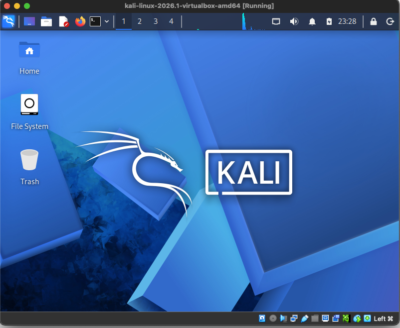
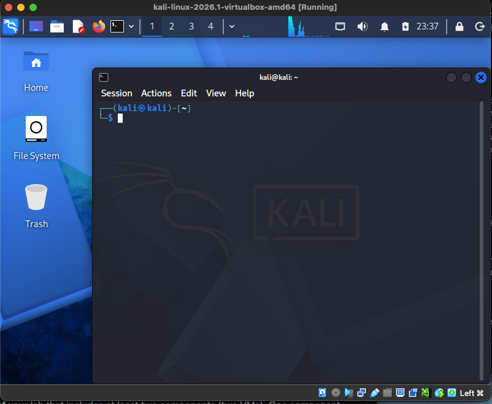
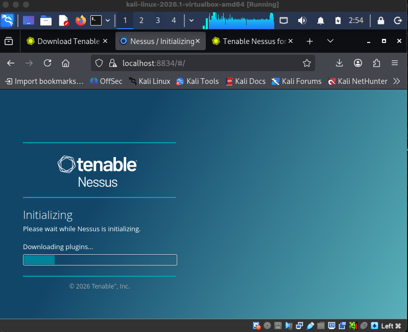
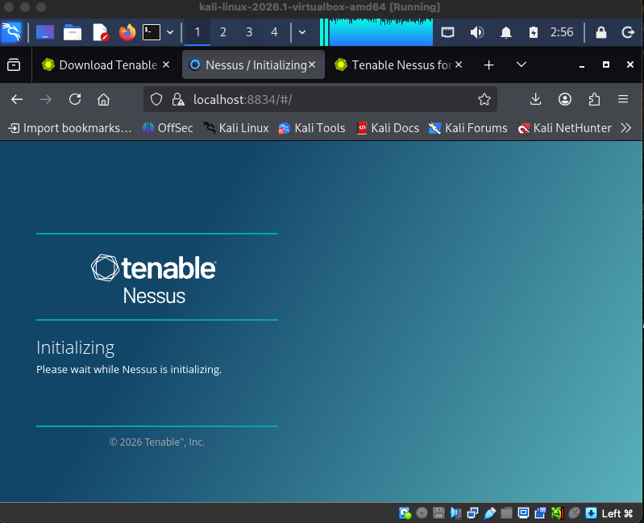
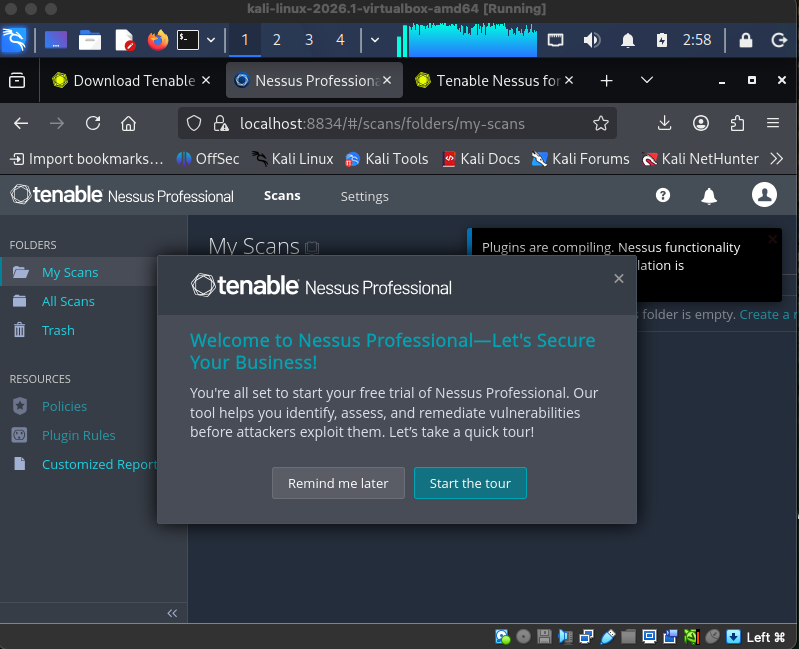
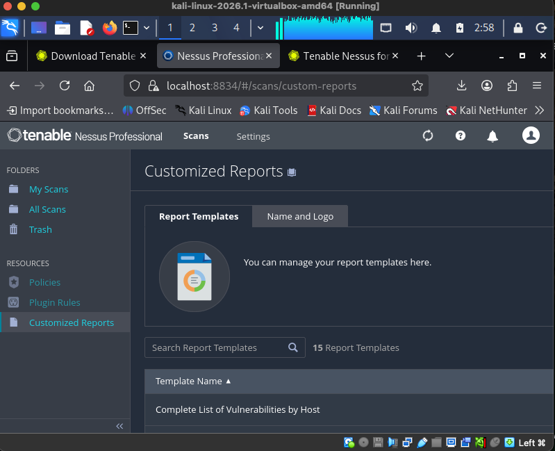
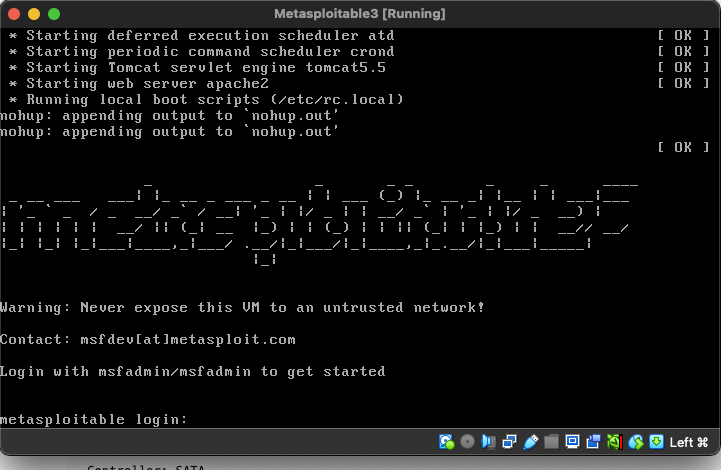
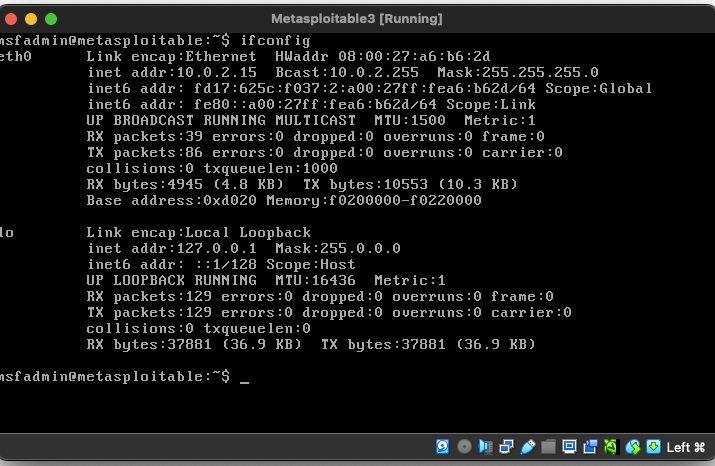
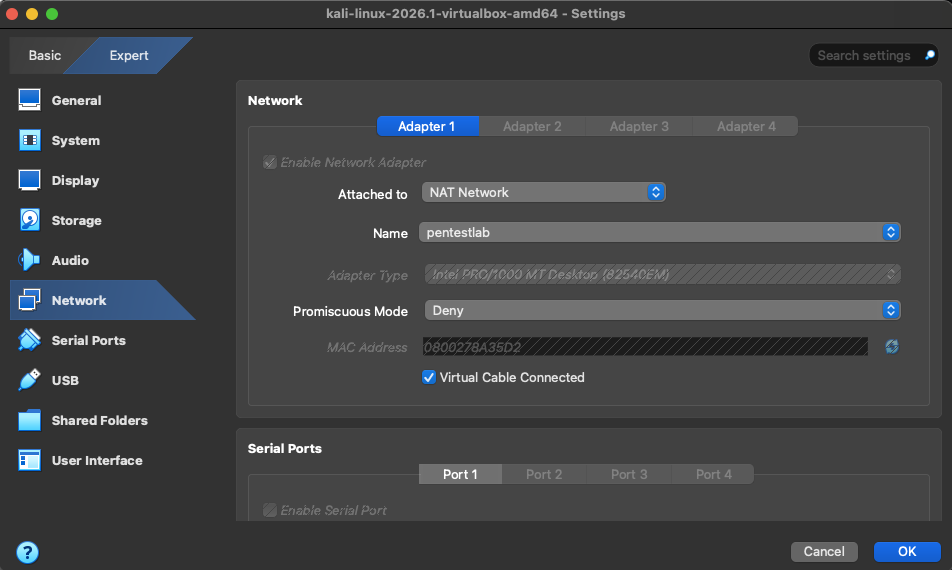
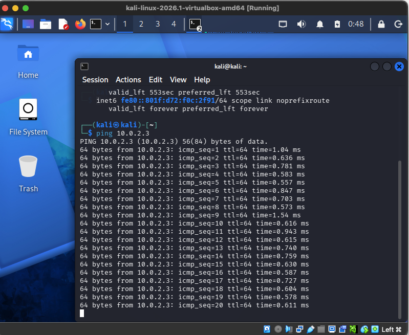

# Assignment #1: Penetration Testing Lab Setup

**Course:** MSSE 642 – Software Assurance  
**Authors:** Abdullah Bahir, Emad Fattah, Shawn Wilkinson  
**Date:** May 2026  
---

## Table of Contents

1. [Overview](#overview)
2. [Technology Stack](#technology-stack)
3. [Architectural Diagram](#architectural-diagram)
4. [Virtualization Environment](#virtualization-environment)
5. [Kali Linux Setup](#kali-linux-setup)
6. [Nessus Installation](#nessus-installation)
7. [Metasploitable Setup](#metasploitable-setup)
8. [Network Connectivity Test](#network-connectivity-test)
9. [Problems & Solutions](#problems--solutions)

---

## Overview

This write-up documents the setup of a local Penetration Testing lab environment for MSSE 642. The goal was to create a minimal but functional pentest lab running on a local machine using virtualization. The lab consists of two virtual machines:

- **Kali Linux** – the attacker machine, used for penetration testing.
- **Metasploitable** – the intentionally vulnerable target machine used as the attack surface.

This environment mirrors industry-standard pen testing setups and will be used for upcoming assignments in Weeks 6 and 8.

---

## Technology Stack

| Component | Details |
|---|---|
| **Host Machine** | MacBook |
| **Host OS** | macOS |
| **Hypervisor Type** | Type 2 – Oracle VirtualBox |
| **Attacker VM** | Kali Linux 2026.1 (virtualbox-amd64) |
| **Target VM** | Metasploitable |
| **VM Network Mode** | Host-only Network |

> **Note on Hypervisor Choice:** Oracle VirtualBox was chosen because it is free, open-source, and Kali Linux provides a pre-built VirtualBox image. Host-only Network mode allows VMs to communicate with each other and access the internet through the host, while remaining isolated from external networks.

---

## Architectural Diagram

Below is the architectural diagram of the lab environment:

**Lab Network Summary:**

```
┌─────────────────────────────────────────────────────────┐
│              Host Machine (macOS)                       │
│                                                         │
│    ┌──────────────────────────────────────────┐         │
│    │  Oracle VirtualBox (Type 2 Hypervisor)   │         │
│    │                                          │         │
│    │   ┌─────────────────────────────────┐   │         │
│    │   │  VirtualBox Host-only Network   │   │         │
│    │   │     (192.168.56.0/24)           │   │         │
│    │   │                                 │   │         │
│    │   │  ┌──────────────────────────┐   │   │         │
│    │   │  │   Kali Linux 2026.1      │   │   │         │
│    │   │  │   (Attacker)             │   │   │         │
│    │   │  │   User: swmsse642        │   │   │         │
│    │   │  │   Tools: Nessus,         │   │   │         │
│    │   │  │          Metasploit      │   │   │         │
│    │   │  └────────────┬─────────────┘   │   │         │
│    │   │               │ Attack Traffic  │   │         │
│    │   │  ┌────────────▼─────────────┐   │   │         │
│    │   │  │   Metasploitable          │   │   │         │
│    │   │  │   (Target / Victim)      │   │   │         │
│    │   │  │   User: msfadmin         │   │   │         │
│    │   │  │   IP:   192.168.56.2        │   │   │         │
│    │   │  │   Services: Apache,      │   │   │         │
│    │   │  │   Tomcat, SSH, FTP ...   │   │   │         │
│    │   │  └──────────────────────────┘   │   │         │
│    │   └─────────────────────────────────┘   │         │
│    └──────────────────────────────────────────┘         │
└─────────────────────────────────────────────────────────┘
```

---

## Virtualization Environment

Oracle VirtualBox was downloaded and installed from the [VirtualBox website](https://www.virtualbox.org/wiki/Downloads). It is free and open-source.

**Steps taken:**
1. Downloaded the VirtualBox installer for macOS from `virtualbox.org`.
2. Ran the installer and completed the setup wizard with default options.
3. Configured each VM's network adapter to Host-only Network via *Settings → Network → Attached to: Host-only Network*.

**Screenshot – VirtualBox running with Kali Linux VM:**



> *The screenshot above shows VirtualBox with the Kali Linux 2026.1 VM powered on and running, as indicated by the `[Running]` state in the title bar.*

---

## Kali Linux Setup

Kali Linux was downloaded from the [official Kali website](https://www.kali.org/get-kali/#kali-virtual-machines) as a pre-built VirtualBox image (64-bit).

**Steps taken:**
1. Downloaded the Kali Linux VirtualBox image from `kali.org`.
2. In VirtualBox, went to *File → Import Appliance* and selected the downloaded image.
3. Completed the import wizard with default settings.
4. Assigned the Host-only Network adapter to the VM under *Settings → Network*.
5. Booted the VM and logged in with username `kali` and password `kali`.
6. Updated the system:
   ```bash
   sudo apt update && sudo apt upgrade -y
   ```

**Screenshot – Kali Linux logged in and running:**



> *The screenshot shows the Kali Linux 2026.1 desktop environment with a terminal open, confirming a successful login as user `kali`.*

---

## Nessus Installation

Nessus Essentials (free tier) was installed on the Kali Linux VM for vulnerability scanning.

**Steps taken:**
1. Registered for a free Nessus Essentials activation code at [tenable.com](https://www.tenable.com/products/nessus/nessus-essentials).
2. Downloaded the Nessus `.deb` package for Debian/Kali (AMD64) from the Tenable downloads page.
3. Installed the package:
   ```bash
   sudo dpkg -i Nessus-latest-debian10_amd64.deb
   ```
4. Started the Nessus service:
   ```bash
   sudo systemctl start nessusd
   sudo systemctl enable nessusd
   ```
5. Navigated to `https://localhost:8834` in the Kali browser to complete the setup wizard and enter the activation code.

**Screenshot – Nessus initializing and downloading plugins:**



> *Nessus initializing at `localhost:8834` after installation, downloading plugins before becoming fully operational.*

**Screenshot – Nessus plugin download in progress:**



> *Nessus completing the plugin download phase. This process takes several minutes on first launch.*

**Screenshot – Nessus Professional dashboard:**



> *Nessus Professional fully running at `localhost:8834`, showing the My Scans dashboard with the welcome prompt confirming successful installation and login.*

**Screenshot – Nessus report templates:**



> *The Nessus Customized Reports page showing 15 available report templates, confirming the scanner is fully operational.*

---

## Metasploitable Setup

Metasploitable is an intentionally vulnerable Linux VM designed as a penetration testing target. (Metasploitable 2 was attempted first but failed to boot — see [Problems & Solutions](#problems--solutions).)

**Steps taken:**
1. Downloaded the Metasploitable VM image.
2. In VirtualBox, imported the VM using *File → Import Appliance*.
3. Assigned the Host-only Network adapter under *Settings → Network*.
4. Booted the VM; the boot sequence showed services starting cleanly (Apache, Tomcat, cron — all `[OK]`).
5. Logged in with the default credentials displayed in the boot banner: `msfadmin` / `msfadmin`.
6. Confirmed network interface and IP address:
   ```bash
   ifconfig
   ```

**Screenshot – Metasploitable boot sequence:**



> *The screenshot shows Metasploitable booting with all services starting successfully. The login banner warns: "Never expose this VM to an untrusted network!" and displays the default credentials.*

**Screenshot – Metasploitable ifconfig:**



> *The screenshot shows `ifconfig` output from Metasploitable after login, confirming the `eth0` interface is up with IP address `192.168.56.2`.*

---

## Network Connectivity Test

To verify that the Kali Linux attacker machine can reach the Metasploitable target, a connectivity test was performed from within the Kali Linux VM.

**Steps taken:**
1. Confirmed Metasploitable's IP address from its terminal (`ifconfig`): `192.168.56.2`.
2. From the Kali Linux terminal, ran:
   ```bash
   ping -c 4 192.168.56.2
   ```
3. Confirmed both VMs were on the same Host-only Network within VirtualBox.

**Screenshot – Kali network configuration (Host-only Network):**



> *The screenshot shows Kali's VirtualBox network adapter set to Host-only Network mode, allowing VM-to-VM communication and internet access through the host machine.*

**Screenshot – Ping from Kali to Metasploitable:**



> *The screenshot shows network activity from the Kali Linux terminal confirming connectivity to the Metasploitable target on the Host-only Network.*

---

## Problems & Solutions

| # | Problem | Solution |
|---|---------|----------|
| 1 | **Metasploitable 2 would not boot** | VirtualBox showed "No bootable medium found" when attempting to run Metasploitable 2. The `.vmdk` disk was not recognized correctly. Switched to Metasploitable, which imported cleanly as a `.vdi` image and booted without issue. |
| 2 | **Incorrect Metasploitable login credentials** | Initially tried `msadmin` as the username, which failed with "Login incorrect". The correct credentials (`msfadmin` / `msfadmin`) are shown in the boot banner. |
| 3 | **Nessus self-signed certificate warning** | Firefox showed "Warning: Potential Security Risk Ahead" (`SEC_ERROR_UNKNOWN_ISSUER`) when opening `https://localhost:8834`. This is expected for a local Nessus instance using a self-signed TLS certificate. Bypassed by clicking Advanced → Accept the Risk and Continue. |

---

## References

- Kali Linux Official Site: [https://www.kali.org](https://www.kali.org)
- Oracle VirtualBox: [https://www.virtualbox.org](https://www.virtualbox.org)
- Tenable Nessus Essentials: [https://www.tenable.com/products/nessus/nessus-essentials](https://www.tenable.com/products/nessus/nessus-essentials)
- Metasploitable: [https://sourceforge.net/projects/metasploitable/](https://sourceforge.net/projects/metasploitable/)
