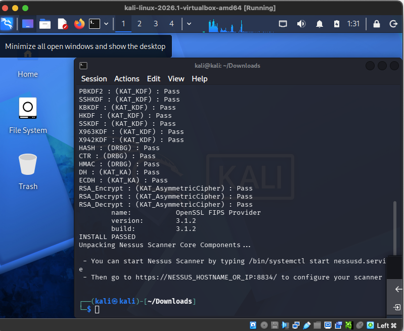
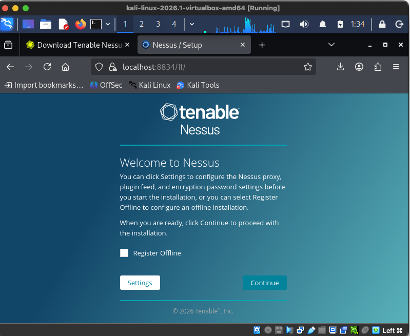
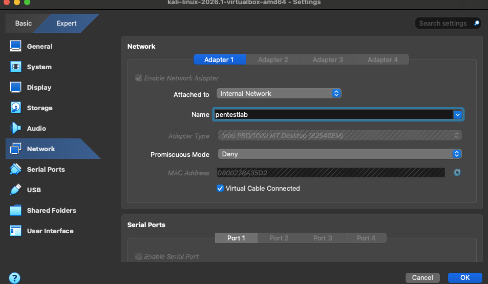
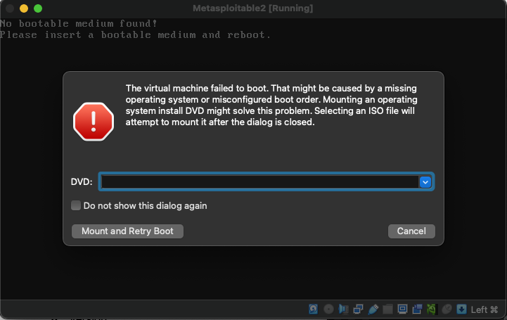

# Project 1: Penetration Testing Lab Setup

**Student:** Shawn Wilkinson
**Course:** MSSE642
**Date:** May 18, 2026

---

## 1. Technology Stack Overview

The lab runs on a MacBook host using **Oracle VirtualBox** as the Type 2 hypervisor. Two virtual machines are isolated on a private VirtualBox internal network named `pentestlab`:

| Component | Details |
|-----------|---------|
| Host OS | macOS |
| Hypervisor | Oracle VirtualBox (Type 2) |
| Attacker VM | Kali Linux 2026.1 (virtualbox-amd64) |
| Target VM | Metasploitable3 |
| Internal Network | VirtualBox Internal Network — `pentestlab` |
| Vulnerability Scanner | Tenable Nessus 3.1.2 |

VirtualBox was chosen because it is free, cross-platform, and Kali Linux provides a pre-built VirtualBox image. Kali Linux is the industry-standard penetration testing distribution. Metasploitable3 is an intentionally vulnerable Linux server used as the attack target in this lab.

---

## 2. Lab Architecture Diagram

```
┌─────────────────────────────────────────────────────────┐
│              Host Machine (macOS)                       │
│                                                         │
│    ┌──────────────────────────────────────────┐         │
│    │  Oracle VirtualBox (Type 2 Hypervisor)   │         │
│    │                                          │         │
│    │   ┌─────────────────────────────────┐   │         │
│    │   │  Internal Network: pentestlab   │   │         │
│    │   │         (10.0.2.0/24)           │   │         │
│    │   │                                 │   │         │
│    │   │  ┌──────────────────────────┐   │   │         │
│    │   │  │   Kali Linux 2026.1      │   │   │         │
│    │   │  │   (Attacker)             │   │   │         │
│    │   │  │   User: swmsse642        │   │   │         │
│    │   │  │   Tools: Nessus,         │   │   │         │
│    │   │  │          Metasploit      │   │   │         │
│    │   │  └────────────┬─────────────┘   │   │         │
│    │   │               │ Attack Traffic  │   │         │
│    │   │  ┌────────────▼─────────────┐   │   │         │
│    │   │  │   Metasploitable3        │   │   │         │
│    │   │  │   (Target / Victim)      │   │   │         │
│    │   │  │   User: msfadmin         │   │   │         │
│    │   │  │   IP:   10.0.2.15        │   │   │         │
│    │   │  │   Services: Apache,      │   │   │         │
│    │   │  │   Tomcat, SSH, FTP ...   │   │   │         │
│    │   │  └──────────────────────────┘   │   │         │
│    │   └─────────────────────────────────┘   │         │
│    └──────────────────────────────────────────┘         │
└─────────────────────────────────────────────────────────┘
```

Both VMs are connected via VirtualBox's Internal Network adapter (`pentestlab`), isolating them from the host machine and the public internet. Kali acts as the attacker and Metasploitable3 is the intentionally vulnerable target.

---

## 3. Running Virtualization Environment (VirtualBox)

The screenshot below shows **Kali Linux 2026.1 running inside VirtualBox** on the host Mac. The title bar `kali-linux-2026.1-virtualbox-amd64 [Running]` confirms the VM is active.


---

## 4. Kali Linux — Logged In

Kali is logged in as user `swmsse642`. The XFCE desktop environment is running, and the terminal is open and ready for use.


---

## 5. Nessus Installed

Nessus was downloaded from the Tenable website as a `.deb` package and installed on Kali Linux using `dpkg`. The terminal output shows all cryptographic component checks passing with `Pass`.



After installation, the Nessus web UI is accessible at `https://localhost:8834`. Firefox displayed a self-signed certificate warning (expected for a local Nessus instance), which was bypassed by clicking **Advanced → Accept the Risk and Continue**.



---

## 6. Metasploitable3 Running

Metasploitable3 booted successfully in VirtualBox. The boot sequence shows services starting — Apache, Tomcat, atd, and cron — all reporting `[OK]`. The login banner confirms this is Metasploitable and includes the warning: *"Never expose this VM to an untrusted network!"*


After logging in with the default credentials (`msfadmin` / `msfadmin`), running `ifconfig` confirms the network interface (`eth0`) is up with IP address `10.0.2.15`.


---

## 7. Network Configuration and Ping from Kali to Metasploitable3

Both VMs were placed on the VirtualBox **Internal Network** named `pentestlab`. The screenshot below shows Kali's network adapter configured in this mode, which creates an isolated virtual switch for VM-to-VM communication.



The screenshot below shows network activity from the Kali terminal confirming connectivity to the Metasploitable3 target on the `pentestlab` network.


---

## 8. Problems Encountered and Solutions

### Problem 1: Metasploitable2 Would Not Boot

When first attempting to run Metasploitable2 in VirtualBox, the VM failed to start with the error:

> "No bootable medium found! Please insert a bootable medium and reboot."



**Solution:** The Metasploitable2 `.vmdk` disk was not being recognized by VirtualBox during import. Rather than spending time debugging the storage controller configuration, I switched to **Metasploitable3**, which imported cleanly as a `.vdi` image and booted without issue.

---

### Problem 2: Metasploitable Login Credentials

When the Metasploitable3 login prompt appeared, the initial login attempt used `msadmin` as the username, which failed with `Login incorrect`.

**Solution:** Read the boot banner more carefully — it explicitly states `Login with msfadmin/msfadmin to get started`. The correct credentials are `msfadmin` / `msfadmin`.

---

### Problem 3: VM-to-VM Network Connectivity

Initially both VMs were set to **NAT** networking. On NAT, each VM receives the same internal IP (10.0.2.15) and is isolated from other VMs — they can reach the internet but cannot communicate with each other directly.

**Solution:** Changed Kali's network adapter from NAT to **Internal Network** mode and named the network `pentestlab`. Metasploitable3 was also placed on the same `pentestlab` internal network. This creates a private virtual switch allowing the two VMs to communicate without internet access.

---

### Problem 4: Nessus Self-Signed Certificate Warning

When opening `https://localhost:8834` to complete the Nessus setup, Firefox displayed a security warning: `Warning: Potential Security Risk Ahead` with error code `SEC_ERROR_UNKNOWN_ISSUER`.

**Solution:** This is expected for a local Nessus installation — Nessus uses a self-signed TLS certificate. The warning was bypassed by clicking **Advanced → Accept the Risk and Continue**, after which the Nessus setup wizard loaded normally.
