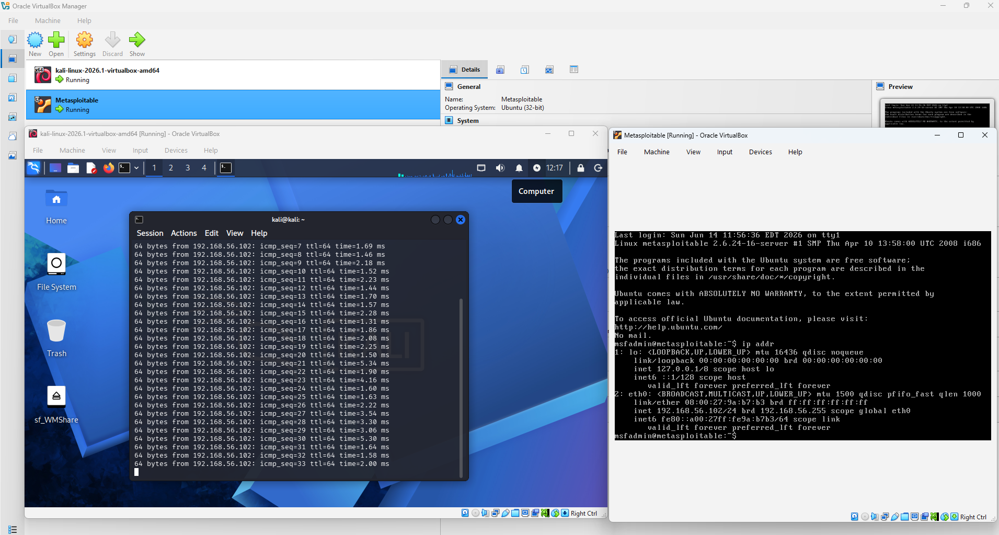
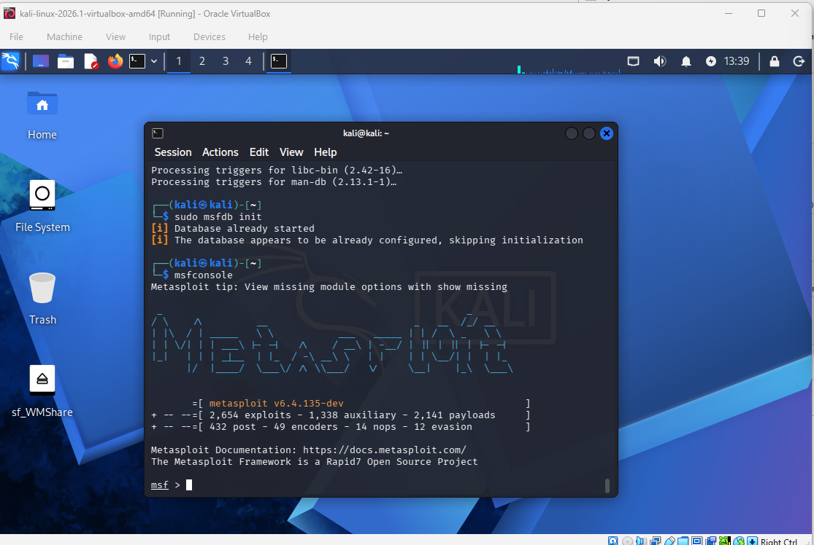
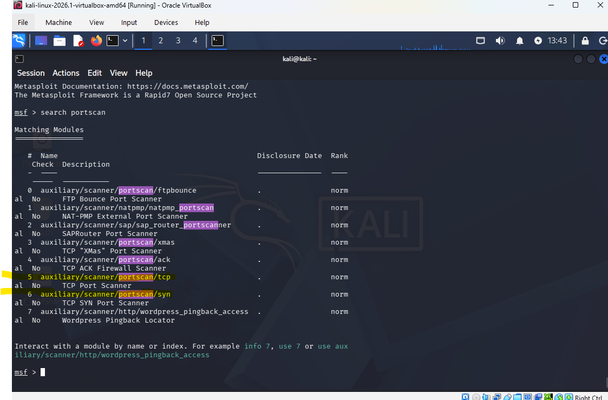
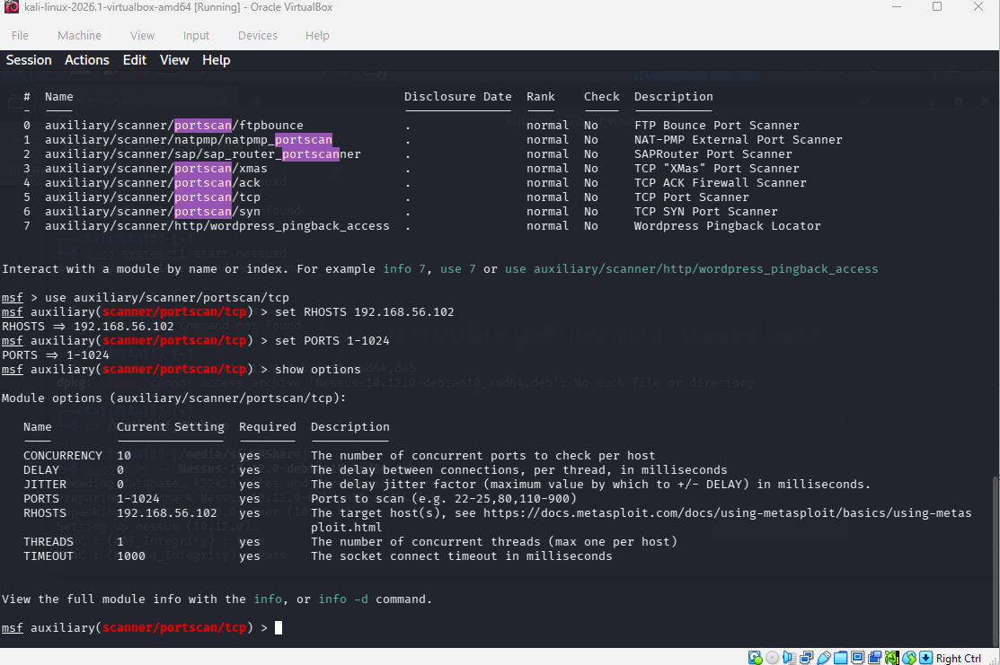
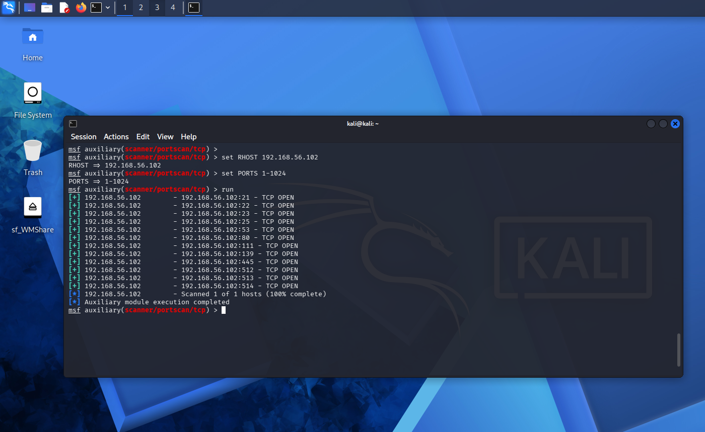

# Hands-On Project 3: Penetration Testing with Kali Linux, Metasploit, and Metasploitable2

## Part 1: Starting Metasploit Framework and Metasploitable2

### Screen Shot 1: Both VMs running and connected

<!-- TODO: Replace with your screenshot showing Kali Linux and Metasploitable2 running and able to communicate (ping/ssh) -->

### Screen Shot 2: Metasploit Framework up and running

<!-- TODO: Replace with your screenshot of `sudo msfdb init && msfconsole` running -->

## Part 2: Port scan of the target VM with Metasploit

### Screen Shot 3: Port scanners returned by `search portscan`

<!-- TODO: Replace with your screenshot showing only the port scanners (not the full scanner list) -->

### Screen Shot 4: Module selected and options set (RHOSTS / PORTS)

<!-- TODO: Replace with your screenshot showing `use auxiliary/scanner/portscan/tcp`, `set RHOSTS 192.168.100.200`, and `set PORTS 1-1024` -->

### Screen Shot 5: Results of the port scan (`run`)

<!-- TODO: Replace with your screenshot of the scan results -->

## Questions

### a. What is the purpose of port scanning from the perspective of a Black Hat hacker?

A Black Hat hacker uses port scanning as a reconnaissance step to map a target's attack surface before attempting to break in. By identifying which ports are open and what services/versions are listening on them, the attacker can pinpoint outdated software, default configurations, or known vulnerabilities to exploit. This scan is typically performed quietly (e.g., with stealth/SYN scans, slow timing, or spoofed sources) to avoid tipping off the target or its intrusion detection systems before the actual attack begins.

### b. What is the purpose of port scanning from the perspective of an Ethical (White Hat) Hacker?

An ethical hacker performs the same kind of port scan, but with authorization and for a defensive purpose: to discover the same open ports, running services, and potential weaknesses that an attacker would find first. The goal is to build an accurate inventory of exposed services, identify misconfigurations or unnecessary open ports, and report these findings to the organization so they can be remediated (patched, closed, or hardened) before a malicious actor can take advantage of them. It is essentially using the attacker's own first step to get ahead of the attacker.

### c. Why did we restrict the scanned ports to 1 through 1024?

Ports 1–1024 are the "well-known" (system) ports assigned by IANA, and they are where the most common and widely used network services traditionally run — for example FTP (21), SSH (22), Telnet (23), SMTP (25), DNS (53), HTTP (80), and HTTPS (443). Restricting the scan to this range lets us quickly check for the services that are most likely to be present and most commonly targeted, without spending the extra time required to scan the full 65,535-port range. It is a practical trade-off between scan speed and coverage, especially useful for an initial pass.

## Part 3: Tool Research — Nessus

### Introduction

Nessus is a vulnerability scanner originally created by Renaud Deraison in 1998 and now developed and maintained by Tenable, Inc. It scans hosts and networks to identify known vulnerabilities, missing patches, misconfigurations, weak/default credentials, and compliance issues, and then reports those findings with severity ratings and remediation guidance. Nessus is available from Tenable's website at <https://www.tenable.com/products/nessus>, which offers a free "Nessus Essentials" edition (limited to scanning a small number of IP addresses, intended for learning and home labs) as well as paid Professional and enterprise editions.

### Big Picture

Within the penetration testing process described in the Singh book (and summarized in Chapter 8, p. 257), Nessus fits into the **Vulnerability Analysis / Scanning** phase, which comes after Information Gathering and Reconnaissance but before Exploitation. Where a tool like the Metasploit `portscan` module simply tells you which ports are open, Nessus goes a step further: it probes the services behind those open ports and cross-references them against a continuously updated database of known vulnerabilities (CVEs), giving the tester a prioritized list of weaknesses to investigate or exploit. In a typical engagement, the output of a Nessus scan becomes the input to the exploitation phase — for example, feeding directly into choosing which Metasploit modules to run against a target such as Metasploitable2.

### Lab

<!-- TODO: Fill this in based on your own hands-on experience. Nessus is NOT included in the default Kali Linux installation — it must be downloaded separately from Tenable (as a .deb package), installed with `dpkg -i`, started as a service, and activated with a free Nessus Essentials activation code/API key obtained by registering on Tenable's site. Describe whether you were able to install and run it against Metasploitable2 in your lab, what you found, and include a screenshot of the scan or its results. If you were not able to install/run it (e.g., resource constraints, activation issues, time), explain why. -->

### Conclusion

Nessus is one of the most widely used vulnerability scanners in the security industry because it automates the otherwise tedious process of checking a host or network against a huge, regularly updated catalog of known vulnerabilities and misconfigurations. It complements port-scanning tools like Metasploit's `portscan` auxiliary modules by turning a simple list of open ports into an actionable, prioritized list of security weaknesses — making it a valuable tool in the scanning/vulnerability-analysis stage of a penetration test, and a natural bridge into the exploitation phase.

### References

- Singh, Glen (2019). *Learn Kali Linux 2019*. Birmingham, UK, Packt. Available at: <https://learning.oreilly.com/library/view/learn-kali-linux/9781789611809/>
- Tenable, Inc. *Nessus Vulnerability Scanner*. Available at: <https://www.tenable.com/products/nessus>
